Let's begin by importing our data:


Next lets attach the different peripheral blood data together:

```
##   ï..Sample          Original.label Treatment Weeks.post.transplant WBC  RBC
## 1     MIG.1 BMT1.MIG (NEP cage 1/2)   control                     5 5.2 9.57
## 2     MIG.2 BMT1.MIG (REP cage 1/2)   control                     5 3.6 9.37
## 3     MIG.3 BMT1.MIG (BEP cage 2/2)   control                     5 6.5 9.58
## 4     MIG.4 BMT1.MIG (REP cage 2/2)   control                     5 6.2 9.74
## 5     MIG.5 BMT2.MIG (cage 2/2 BEP)   control                     5 4.5 9.84
## 6     MIG.6 BMT2.MIG (cage 2/2 LEP)   control                     5 3.0 9.83
##    HGB  HCT MCV  MCH MCHC PLT MPV  RDW Percent.Lym Percent.Mon Percent.Gra
## 1 14.7 45.7  48 15.4 32.2 473 6.8 15.7          NA          NA          NA
## 2 14.3 43.0  46 15.3 33.3 605 6.5 15.5          NA          NA          NA
## 3 14.6 44.4  46 15.3 32.9 453 6.7 15.3          NA          NA          NA
## 4 15.1 45.7  47 15.5 33.1 540 7.3 15.3          NA          NA          NA
## 5 14.6 45.8  46 14.9 32.0 631 6.5 16.0          NA          NA          NA
## 6 14.4 44.8  46 14.6 32.2 900 6.0 15.8          NA          NA          NA
##   Number.Lym Number.Mon Number.Gra  GFP
## 1        2.3        0.3        2.6 85.2
## 2        2.1        0.3        1.2 86.8
## 3        3.0        0.5        3.0 88.7
## 4        3.6        0.5        2.1 87.8
## 5        2.6        0.4        1.5 82.3
## 6        1.4        0.2        1.4 82.2
```

We will make a copy of the total data for manipulation:

What are the dimensions of our data?

```
## [1] 368  21
```

## Peripheral bleeds 5 weeks post-transplant:
Next we will filter for CBC data at 5 weeks post-transplant


Let's check the dimensions of our subsetted data:

```
## [1] 48 21
```

Let's make dotplots for our CBC counts:

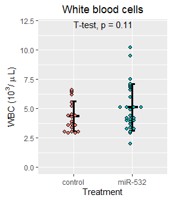<!-- -->


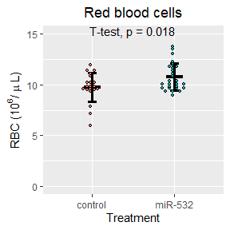<!-- -->


<!-- -->


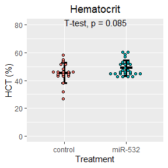<!-- -->


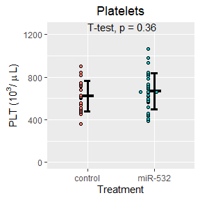<!-- -->


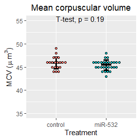<!-- -->


<!-- -->


<!-- -->


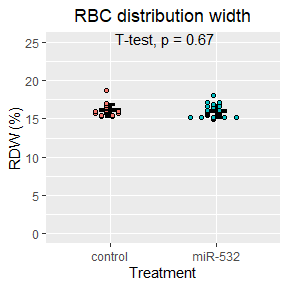<!-- -->


<!-- -->


<!-- -->


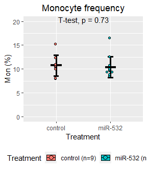<!-- -->


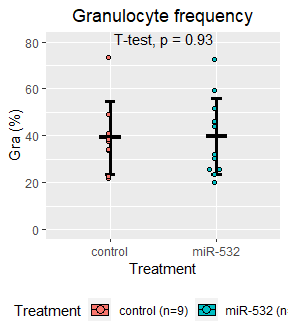<!-- -->


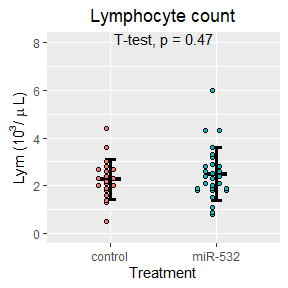<!-- -->


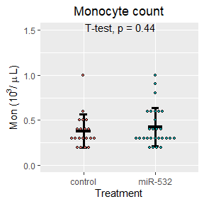<!-- -->


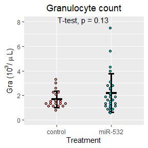<!-- -->

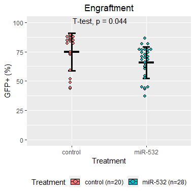<!-- -->


### Now let's arrange the plots:
#### Figure 1
<!-- -->

#### Figure 2
<!-- -->

### Notes
The four miR-532 mice with high granulocytes and lower peripheral blood engraftment (37-45% GFP+) at week 5:

At week5  
ID, GFP+ %, Lym, Mon, Gra  
miR532-29, 43.2,  1.8, 0.9, 7.5  
miR532-14, 45.5, 1.1, 0.3, 5.6  
miR532-30, 37.4, 2.0, 0.8, 4.3  
miR532-8, 44.3, 0.9, 0.2, 4.0  

At week11  
ID, GFP+ %, Lym, Mon, Gra  
miR532-29,  
miR532-14, 43.1, 3.0, 0.5, 5.8  
miR532-30,  
miR532-8, 55.0, 2.3, 0.4, 2.6   


## Now lets separate the data based on the transplanter:

We begin by joining the metadata to the week 5 CBC data


# Peripheral bleeds 11 weeks post-transplant:
Next we will filter for CBC data at 11 weeks post-transplant

```
##     ï..Sample          Original.label Treatment Weeks.post.transplant  WBC
## 28      MIG.1 BMT1.MIG (NEP cage 1/2)   control                    10  5.0
## 29      MIG.2 BMT1.MIG (REP cage 1/2)   control                    10 11.1
## 30      MIG.3 BMT1.MIG (BEP cage 2/2)   control                    10  3.4
## 31      MIG.4 BMT1.MIG (REP cage 2/2)   control                    10  3.8
## 234    MIG.12        MB_miR BMT_MIG_1   control                    10  4.3
## 235    MIG.13        MB_miR BMT_MIG_2   control                    10  6.5
##       RBC  HGB  HCT MCV  MCH MCHC PLT MPV  RDW Percent.Lym Percent.Mon
## 28  10.84 16.4 50.4  46 15.1 32.5 614 6.4 15.3          NA          NA
## 29  10.81 15.5 47.7  44 14.4 32.6 567 6.7 15.9          NA          NA
## 30  11.07 16.0 48.0  43 14.5 33.4 720 6.0 14.6          NA          NA
## 31  11.22 16.0 49.3  44 14.3 32.5 790 6.4 15.5          NA          NA
## 234 11.80 15.9 53.3  45 13.4 29.7 661 6.4 14.9        67.3         9.6
## 235 12.34 16.4 55.3  45 13.3 29.6 581 6.7 14.6        66.0         9.2
##     Percent.Gra Number.Lym Number.Mon Number.Gra  GFP
## 28           NA        3.1        0.4        1.5 86.7
## 29           NA        4.3        0.7        6.1 87.5
## 30           NA        2.2        0.2        1.0 88.9
## 31           NA        2.4        0.2        1.2 84.8
## 234        23.1        2.9        0.4        1.0   NA
## 235        24.8        4.3        0.6        1.6   NA
```

Let's check the dimensions of our subsetted data:

```
## [1] 58 21
```

Let's make dotplots for our CBC counts:

<!-- -->


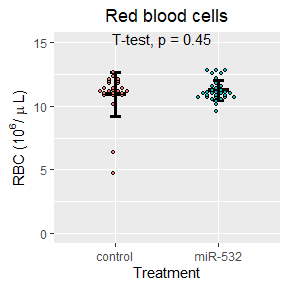<!-- -->


<!-- -->


<!-- -->


<!-- -->


<!-- -->


<!-- -->


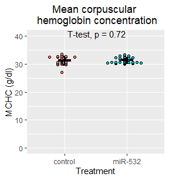<!-- -->


<!-- -->


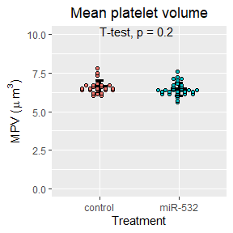<!-- -->


<!-- -->


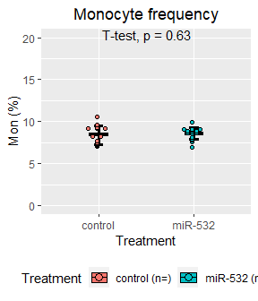<!-- -->


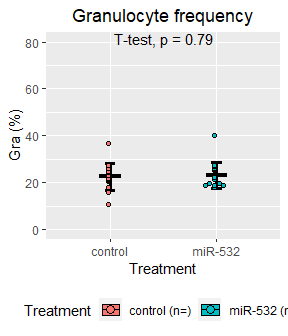<!-- -->


<!-- -->


<!-- -->


<!-- -->

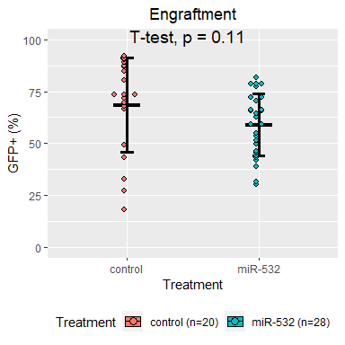<!-- -->

### Now let's arrange the plots:
#### Figure 3
<!-- -->

#### Figure 4
<!-- -->

